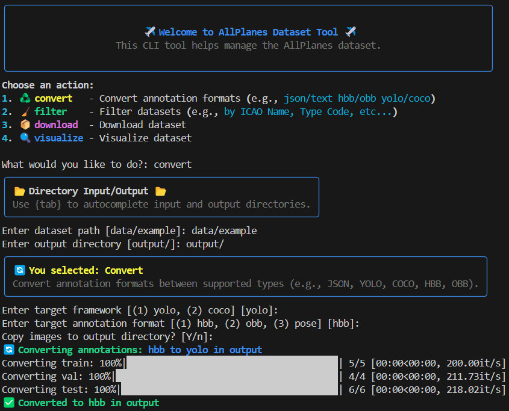
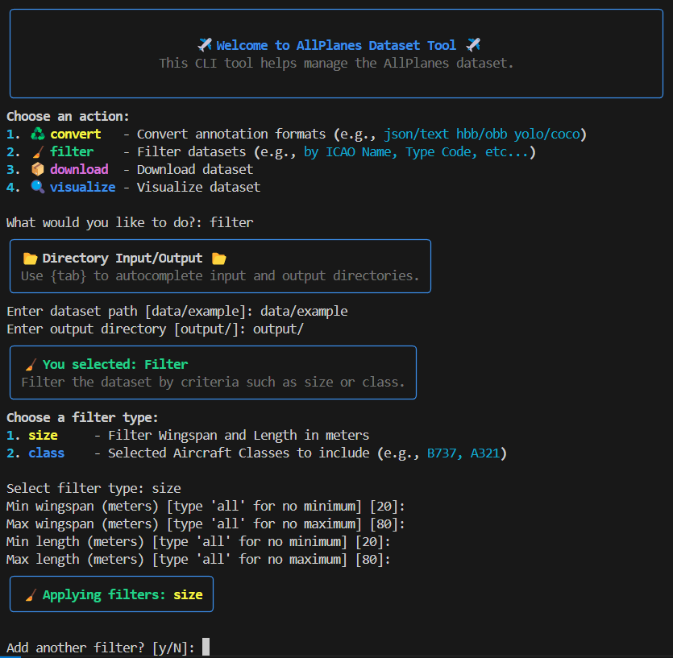

# AllPlanes Dataset Utility

<p align="center">
  
</p>

Toolkit for managing aircraft detection datasets, with support for format conversion (AllPlanes ⇄ YOLO), filtering, and dataset organization.

## 🔧 Features

* **Format Conversion:** AllPlanes ⇄ YOLO (HBB, OBB, Pose)
* **Filtering:** By aircraft type, size, or class
* **Dataset Management:** Split data into train/val/test directories

## 📁 Dataset Structure

```
AllPlanes/
├── main.py                # CLI entry point
├── classes.txt            # ICAO codes
├── requirements.txt       # Python dependencies
└── data/
  ├── AllPlanes.csv        # Aircraft metadata
  └── example/
    ├── train/
    │   ├── images/        # PNG images
    │   └── annotations/   # JSON annotations
    ├── val/
    │   ├── images/
    │   └── annotations/
    └── test/
      ├── images/
      └── annotations/
```

## 📝 Annotation Formats

### AllPlanes (Native)

```json
{
  "labels": ["K35R", "K35R"],
  "bboxes": [[321,174,511,357],[288,423,477,606]],
  "keypoints": [
    [[324,252,1],[437,357,1],[503,271,1],[457,175,1]],
    [[290,501,1],[403,605,1],[469,520,1],[424,424,1]]
  ]
}
```

* `labels`: ICAO codes
* `bboxes`: `[x_min, y_min, x_max, y_max]`
* `keypoints`: Four `[x, y, v]` entries per object (keypoints of nose, tail, and wingtips)

### YOLO Formats

* **HBB (Horizontal Bounding Box):**

  ```
  <class_id> <center_x> <center_y> <width> <height>
  ```

* **OBB (Oriented Bounding Box):**

  ```
  <class_id> <x1> <y1> <x2> <y2> <x3> <y3> <x4> <y4>
  ```

* **Pose:**

  ```
  <class_id> <center_x> <center_y> <width> <height> <x1> <y1> <v1> ... <xN> <yN> <vN>
  ```

## 🚀 CLI Usage

### Format Conversion

Convert from AllPlanes to YOLO (HBB, OBB, or Pose):

<p align="center">
  
</p>

### Filtering

Filter dataset by aircraft class or size:

<p align="center">
  
</p>

## 📄 Citations

Bibtex

---

For more details, see the code and docstrings in `convert.py`, `filter.py`, and `main.py`.
